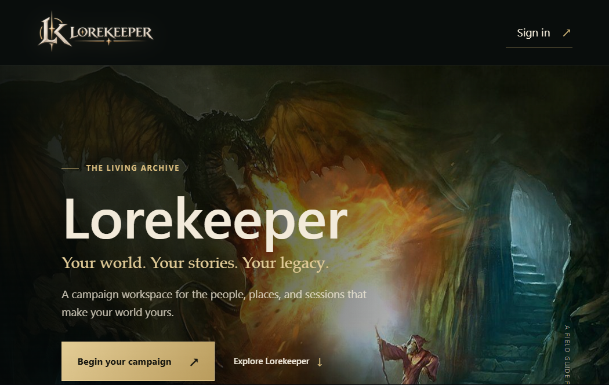
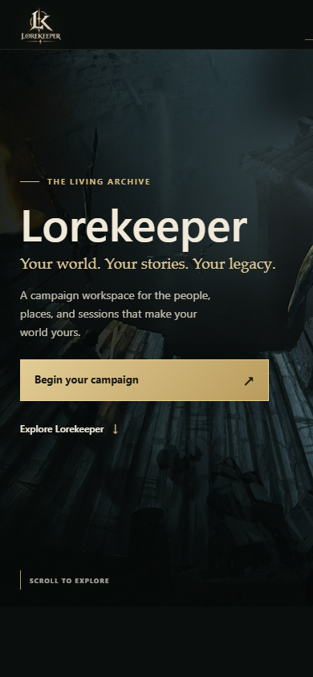
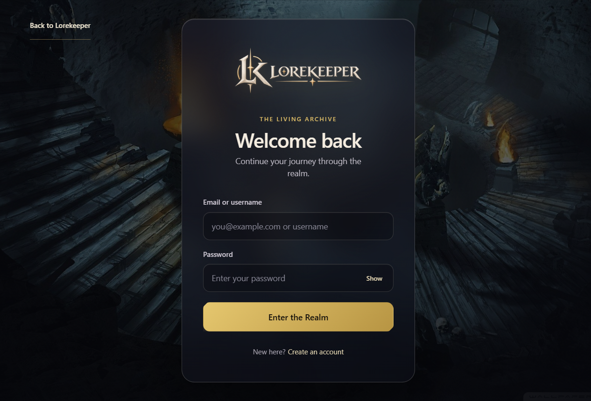
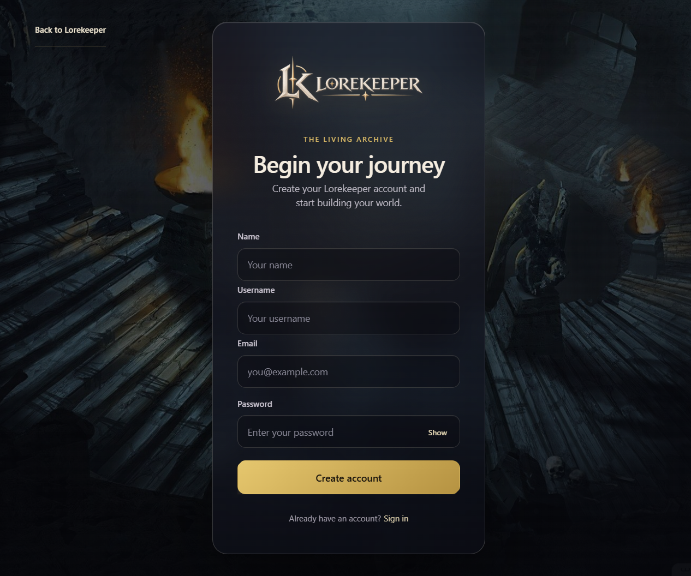
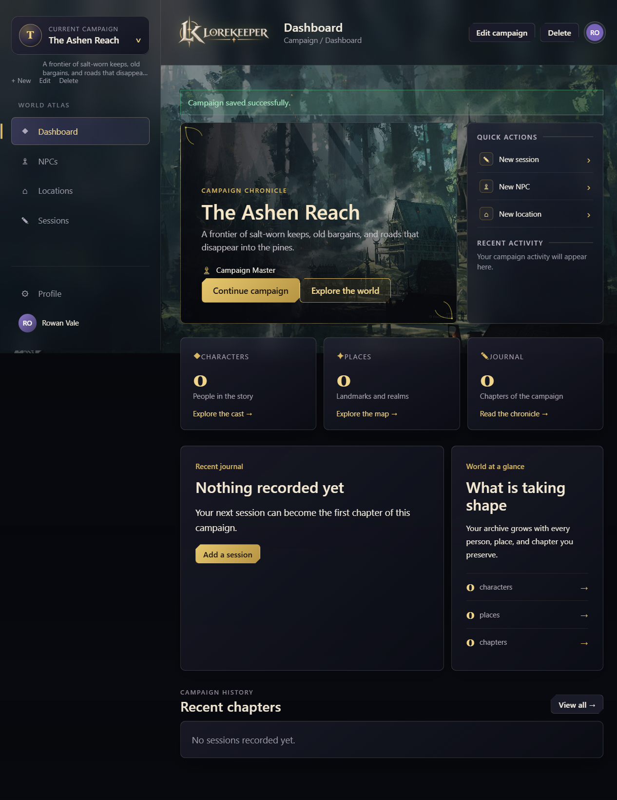
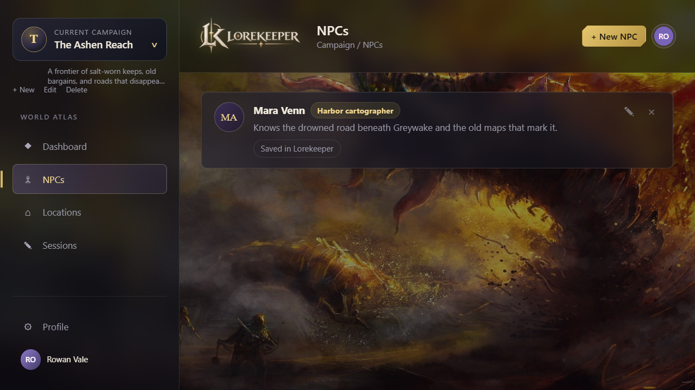
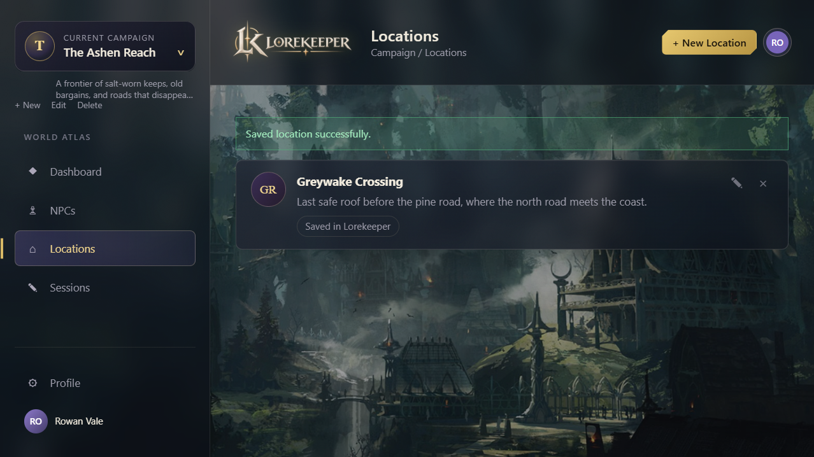
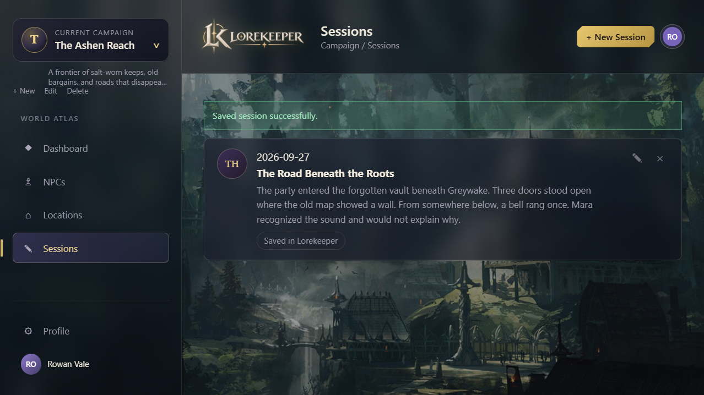

# Mockup and interface blueprint

The Lorekeeper UI is designed as a dark, atmospheric fantasy dashboard that feels like a GM’s campaign workspace rather than a generic CRUD interface. The layout is structured around a campaign-first flow, where the selected campaign acts as the container for all world-building and session planning records.

## Core screens

### 1. Auth screen

The login and registration flow uses a focused card layout with a strong title treatment and action buttons. The visual language is dramatic but clear, with high contrast typography and a fantasy-leaning colour palette.

Key elements:

- brand or title area
- email or username login field
- password field
- primary CTA button
- secondary route for account creation
- support text for account recovery or alternate flows

### 2. Campaign dashboard

The dashboard is the primary overview screen. It presents the selected campaign and quick access to the most important campaign records.

Typical content:

- current campaign selector or switcher
- summary cards for NPC count, location count, and session count
- recent session entries or activity highlights
- quick actions to create new content
- campaign description and world notes

### 3. NPC management screen

This screen lists NPCs for the active campaign. Entries expose:

- name
- role
- description
- notes
- optional resource image or portrait reference

The layout supports both browsing and editing, using a compact list of cards or rows and a modal form for editing or creating items.

### 4. Location management screen

Locations follow the same structure as NPCs, giving the GM a place to track:

- location name
- description
- notes
- optional image or map reference

This screen is intended to support world design and continuity between sessions.

### 5. Session journal screen

The session log is a chronological record of campaign events. Each entry includes:

- session title
- date
- recap or notes
- optional update to campaign continuity

This screen is central to the app’s purpose and should feel like a clean record of what happened in play.

## Mobile behaviour

The app is designed to adapt to narrow mobile viewports without sacrificing the core experience. On smaller screens, content stacks into a more compact layout and the campaign switcher remains accessible through a simplified sheet or drawer pattern.

The key mobile considerations are:

- single-column layouts where possible
- touch-friendly buttons and form fields
- stacked summary cards for quick reading
- compact campaign switcher and navigation patterns

## Visual design direction

The app uses a dark theme with warm gold accents and violet/magenta highlights. This creates a fantasy-inspired interface without becoming cluttered or illegible.

The style is intentionally built around:

- contrast-rich backgrounds
- layered glass-like surfaces
- high-visibility CTA buttons
- clear focus rings and keyboard focus states
- decorative gradients and atmospheric visual texture

## Screenshot gallery

The images below document the current deployed public pages and the authenticated application screens. They were captured on 2026-10-10. The landing, sign-in, and registration screens are from the deployed GitHub Pages site. Dashboard and record-list screenshots use invented sample content in a local development session; they are illustrative captures, not screenshots of a production account or proof of production database contents.

### Public site

### Authenticated workspace

### Mobile capture status

The public landing page has been captured at a 390px viewport. The authenticated workspace is not yet represented at mobile size: the available capture environment did not reliably apply a phone viewport to that flow, so its output was clipped and would misrepresent the app. Before treating the in-app mobile presentation as visually verified, capture the deployed workspace on a phone or in a browser with a verified 390px CSS viewport.

## Mockup status

The repository also contains an [editable HTML mockup](../project/Lorekeeper%20%E2%80%93%20App%20Mockup%20(1).html) and supporting visual assets in [../project](../project). Use those as design references, while treating the screenshot gallery above as the record of the current implementation.

## Implementation notes

The current app directly reflects this design direction through:

- a dark campaign-themed shell
- rounded cards and modal forms
- a campaign switcher UI
- fantasy-inspired accent colours
- responsive layout behaviour for multiple screen sizes

## Keeping the mockup accurate

Refresh the related screenshots whenever a major screen or design change ships. Use invented sample content, avoid exposing real account details, and capture the deployed build for public-facing pages. For authenticated workspace captures, label local/demo data clearly and do not imply that a local in-memory record is stored in production.

Any proposal feature that is not represented in the implemented app should remain labelled as a future enhancement, not shown as an existing screen.
